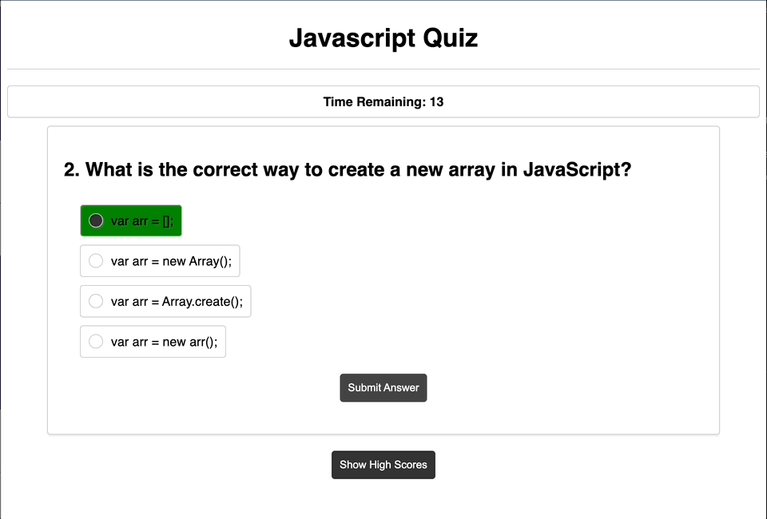

# Code Quiz

## Technology Used 

| Technology Used         | Resource URL           | 
| ------------- |:-------------:| 
|  JavaScript | [https://developer.mozilla.org/en-US/docs/Web/JavaScript](https://developer.mozilla.org/en-US/docs/Web/JavaScript)     |  
|  HTML    | [https://developer.mozilla.org/en-US/docs/Web/HTML](https://developer.mozilla.org/en-US/docs/Web/HTML) | 
|  CSS     | [https://developer.mozilla.org/en-US/docs/Web/CSS](https://developer.mozilla.org/en-US/docs/Web/CSS)      |   
|  Git | [https://git-scm.com/](https://git-scm.com/)     |    

## Description 

[Visit the Deployed Site](https://mccoydidericksen.github.io/code-quiz)

This website provides users with an opportunity to test their basic JavaScript knowledge in a timed quiz format. Users select and submit answers to multiple choice questions. If the option submitted is correct, 5 seconds is added to the timer and the option is highlighted green. If the option submitted is incorrect, 5 seconds is subtracted from the timer. The quiz ends once the timer hits 0 seconds or all questions are answered. After the quiz ends, users can submit their score to a highscore list that will save their results to local storage. 

## Functionality


## Code Snippets
The below code snippet is the approach I took to sorting the list of score objects by the score value. Sorting the list of objects by value is necessary to correctly display the high score list in descending order. Using a nested for loop, the code checks if the current iteration value is less than the rest of the list item values and sets the scores to the correct index.

```javascript
function showScores() {
    document.getElementById("results").style.display = "block";
    if(scoreList){
        // sort scoreList
        for(var i=0; i<scoreList.length; i++){
            for(var j=i+1; j<scoreList.length; j++){
                if(scoreList[i].score < scoreList[j].score){
                    var temp = scoreList[i];
                    scoreList[i] = scoreList[j];
                    scoreList[j] = temp;
                }
            }
        }
        //clear all scoreEl if exists
        while(scoreListEl.firstChild){
            scoreListEl.removeChild(scoreListEl.firstChild);
        }
        // display scoreList
        for(var i=0; i<scoreList.length; i++){
            var scoreEl = document.createElement("li");
            scoreEl.textContent = scoreList[i].initials + " - " + scoreList[i].score;
            scoreListEl.appendChild(scoreEl);
        }
    }
}
```
## Learning Points 

* It's easy to get wrapped up in a specific feature build before you have a functional mvp - have a detailed plan and stick to it!
* Sometimes you'll realize half way through a project that your approach was all wrong. Cut your losses early and get back to the drawing board! It's not worth time or effort attempting to get bad starter code to function.
* Local storage is a great asset for smaller applications like this one.